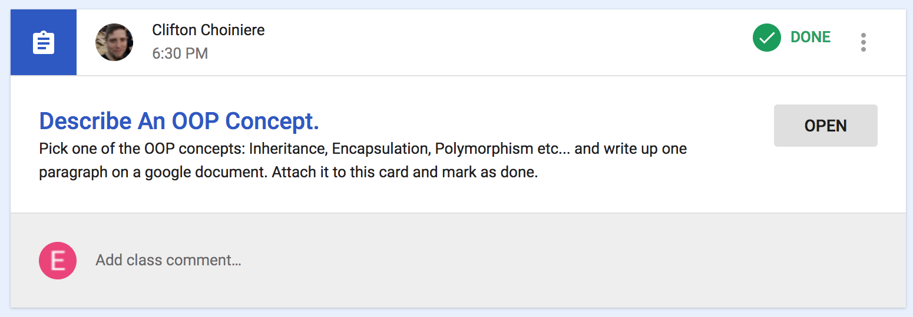

# OOP Concept Assignment

Edward Dupre

Assignment: Describe an OOP Concept

January 9, 2018

For this assignment, I chose to describe Polymorphism because it’s not easy to explain.  Also, I like the way the Lego video explained it in Section 4 Lecture 9.  

Basically, polymorphism allows the program to do one thing if you get one type of object, and do a different thing for a different type of object.

In the video, he showed method overloading, by passing an int in one call to the Count() method and passing a float in the next example.  

I wrote this little java program to show the Polymorphism concept with method overriding instead of overloading.  It at my github repo here → https://github.com/code-42/IntroductionToJava/tree/OOP_Concept_Assignment/PolymorphismExample 

As I demonstrate in my Polymorphism Example program, I changed the behavior of the abstract MakeSound() method in the superclass, by implementing the MakeSound() method in the dog and cat subclasses. 

I left out constructors and fields so I could focus specifically on the behavior of the dog object and the cat object, each implementing the abstract method MakeNoise() in their own way.  And it works.

These are the two lines that shows it works:

        System.out.println(dog.MakeSound()); // Bow Wow
        System.out.println(cat.MakeSound()); // Meow

